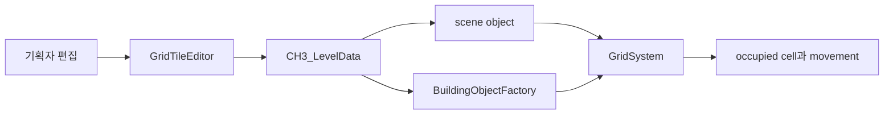

# Grayed Game

잊힌 게임이 떨어지는 회색 마을에서 챕터마다 다른 장르와 시스템을 만나는 PC 2D 메타픽션 어드벤처입니다.

[플레이 영상](https://www.youtube.com/watch?v=fdvunwIGKAs) | [공개 build](https://drive.google.com/file/d/1NscghxWgvjWWtu2stNFduW3cMFrBb4fl/view?usp=sharing)

[게임 설계](docs/game-design.md) | [제작 도구](docs/tooling.md) | [개인 기여](docs/contributions.md) | [검증](docs/verification.md)

## 프로젝트 개요

| 항목 | 내용 |
| --- | --- |
| 플랫폼 | PC |
| 엔진 | Unity 2022.3.62f2 |
| 장르 | 2D 어드벤처, 미니게임, 메타픽션 |
| 개발 기간 | 2023.09 - 2026.01 |
| 협업 | 기획, 개발, 아트, 사운드 팀 프로젝트 |
| 개인 역할 | 게임플레이 프로그래머, CH2 SuperArio, CH3 시스템, 에디터 도구, Dancepace와 상호작용 |

Grayed Game은 잊힌 게임이 모이는 마을에서 라플리가 여러 게임의 규칙을 사용해 사건을 해결하는 이야기입니다. top-down 탐험을 중심에 두고 리듬, 플랫폼, TRPG, 자원 수집과 건설 규칙을 접속 콘텐츠로 연결합니다.

| Dancepace 리듬 미니게임 | CH3 건설과 자원 시스템 |
| --- | --- |
|  |  |

장르가 바뀌는 흐름과 각 시스템의 실제 동작은 플레이 영상에서 확인할 수 있습니다.

## 팀 결과

- 2024 BIC Rookie 부문 온오프라인 전시
- 2024 LOGIN 대학생 연합 발표회 기획 우수상
- 여러 장르의 플레이를 하나의 실행 가능한 빌드로 통합

전시와 수상, 전체 게임 설계, 아트와 사운드는 팀 결과입니다.

## 개인 기여

이시원은 2024년 10월부터 2026년 1월까지 프로그래머 2명 체제에서 CH2 SuperArio 플랫포머, CH3와 Dancepace를 중심으로 작업했습니다.

| 영역 | 구현 범위 |
| --- | --- |
| CH2 SuperArio | player 이동과 jump buffer, obstacle pool과 stage, item box, 상점, pipe 전환과 reward room |
| CH3 grid | world와 grid 좌표, occupied cell, spawn과 object state |
| Tile editor | type 선택, click과 drag 배치, spawn point, block fill과 겹침 방지 |
| Building | build mode, preview, factory, production, crafting과 inventory |
| Teleporter | 지역 활성화, list UI, fade 전환과 거리 기반 닫기 |
| Dancepace | wave data, input timing, character, UI, 관객과 sound 연출 |
| Interaction | Yarn dialogue, NPC, event area와 shop text 연결 |
| Maintenance | reflection 제거, editor build 제외, 사용하지 않는 field와 memory risk 정리 |

파일과 commit별 근거는 [개인 기여 문서](docs/contributions.md)에 구분했습니다.

### CH2 SuperArio 플랫포머 기여

`Assets/Scripts/Runtime/CH2/SuperArio`에는 횡스크롤 이동과 피격, obstacle spawn, coin과 item, 상점, pipe, stage와 reward 흐름이 있습니다. `ArioManager`는 stage state를, player와 obstacle class는 각 동작을 맡습니다.

해당 경로의 Git history에는 이시원 계정 두 개로 기록된 commit 89개와 다른 contributor commit 4개가 있습니다. 이 수치는 ownership 비율이 아니라 input 교체, stage, 상점, jump buffer, 연출, balancing과 bug fix의 변경 범위를 찾는 색인입니다.

## 대표 문제: 기획 변경을 바로 확인하는 Grid editor

기획자는 spreadsheet로 map 수정을 전달했고, 프로그래머가 Unity scene에 다시 배치했습니다. 작은 content 변경도 구현자와 build를 거쳐야 해서 기획자는 결과를 바로 확인하기 어려웠습니다.

### 반복 비용의 원인

초기 editor는 Scene View update마다 `GridSystem` search와 reflection을 수행하고, 강제 Repaint와 배치 object scan을 반복했습니다. 편집 확인을 빠르게 하려던 흐름이 반복 탐색과 redraw 비용까지 함께 만들었습니다.

### 선택한 경계

`GridTileEditor`에서 기획자가 Scene View로 object를 배치하거나 삭제하고, 같은 scene을 Play로 확인하도록 했습니다. object type, footprint, sprite, collision과 passability는 `CH3_LevelData`에 두어 editor와 runtime이 같은 규칙을 읽게 했습니다.

editor는 `GridObjectDataManager`를 통해 배치하고, runtime은 `BuildingObjectFactory`가 같은 data를 읽어 object를 만듭니다. `GridSystem`은 world와 grid 좌표, occupied cell과 spawn을 관리합니다. 이 경계로 편집 시점과 실행 시점의 생성 책임은 나누되 object 규칙은 한곳에서 유지했습니다.

강제 Repaint를 없애고 `GridSystem` reference와 공개 property를 직접 사용했습니다. occupied position은 `HashSet`으로 구성해 겹침을 확인하고, child count가 바뀔 때만 다시 수집합니다.

### 관측과 한계

같은 장비와 같은 scene의 프로젝트 기록에서 Editor main thread frame time은 1084.8ms에서 52.7ms였습니다. raw profiler log와 반복 측정 분포가 없으므로 이 값은 당시 same-scene observation이며 benchmark, 평균 개선율이나 일반 성능 수치로 쓰지 않습니다.

## CH3 editor와 runtime

editor 배치와 플레이 중 건설이 같은 data rule을 사용합니다. `GridSystem`은 occupied cell과 spawn을 관리하고 `BuildingObjectFactory`는 type에 맞는 runtime object를 만듭니다.

세부 흐름과 SuperArio, teleporter, Dancepace data는 [제작 도구 문서](docs/tooling.md)에 있습니다.

## 실행

1. Unity Hub에서 Unity 2022.3.62f2로 프로젝트를 엽니다.
2. package import가 끝날 때까지 기다립니다.
3. main scene을 열고 Play를 실행합니다.

저장소에는 Unity Test Framework test assembly가 없습니다. 이 문서 개편에서는 source, 프로젝트 version, Git history, link와 Markdown diff를 확인했습니다.

## 현재 한계

- 게임 전체 story와 모든 chapter의 완성을 주장하지 않습니다.
- editor frame time은 same-scene observation이며 원본 profiler distribution이 없습니다.
- source를 새로 빌드하거나 gameplay를 다시 측정하지 않았습니다.
- 공개 build와 수상은 현재 README의 프로젝트 기록을 유지합니다.
- 저장소의 코드와 asset에는 별도 open-source license가 명시되어 있지 않습니다.

## 팀

| 이름 | 역할 | 참여 기간 |
| --- | --- | --- |
| [한수빈](https://github.com/roweclaw) | 팀장, 기획 | 2024.03 - |
| [정우연](https://github.com/wooyn730) | PM, 프로그래머 | 2023.09 - |
| [송기화](https://github.com/Songkihwa) | 사운드 디자이너 | 2023.09 - |
| [이시원](https://github.com/NearthYou) | 프로그래머 | 2024.10 - |
| [서주미](https://github.com/seojumi) | 아티스트 | 2025.02 - |
| [이성연](https://github.com/4t4n) | 아티스트 | 2025.02 - |
| [이동호](https://github.com/CreatorLDH) | 기획 | 2023.09 - 2024.02, 2025.02 - |
| [지수민](https://github.com/Sumindd) | 기획 | 2024.03 - 2025.03, 2025.05 - |

이전 참여자의 이름과 기간은 Git history의 기존 README에서 계속 확인할 수 있습니다.
