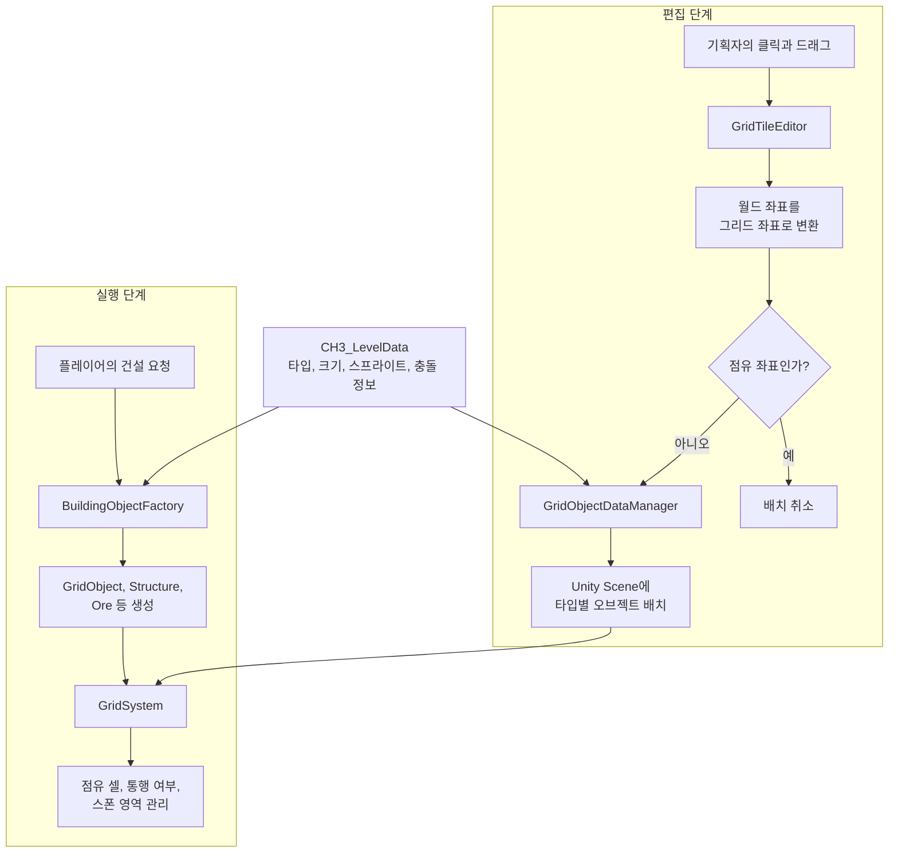

# Grayed Game - 장르 혼합 메타픽션 어드벤처
> 잊혀진 게임들이 모이는 마을을 배경으로, 챕터마다 다른 장르와 시스템을 결합하는 PC 2D 어드벤처 게임

_잊혀진 게임들이 모이는 마을이 있다. 어느 날, 게임이 아닌 것이 떨어졌다._

---

## 개요

| 항목 | 내용 |
|------|------|
| 플랫폼 | PC / Unity |
| 엔진 | Unity 2022.3.62f2 |
| 장르 | 2D 어드벤처 / 미니게임 / 메타픽션 |
| 개발 기간 | 2023.09 ~ 2026.01 |
| 팀 구성 | 기획, 개발, 아트, 사운드 협업 프로젝트 |
| 포지션 | 게임플레이 프로그래머 / CH3 시스템 구현 / 툴, UI, 상호작용 개발 |
| 영상 | [YouTube](https://www.youtube.com/watch?v=fdvunwIGKAs) |
| 저장소 | [GitHub](https://github.com/NearthYou/Grayed-Game) |
| 빌드 파일 | [Drive](https://drive.google.com/file/d/1NscghxWgvjWWtu2stNFduW3cMFrBb4fl/view?usp=sharing) |

---

## 프로젝트 설명

Grayed Game은 잊혀진 게임들이 떨어지는 마을에서 주인공 라플리가 여러 게임의 시스템을 활용하며 마을의 비밀을 풀어가는 장르 혼합 어드벤처 게임이다.

메인 챕터는 탑다운 어드벤처를 기반으로 진행되고, 각 챕터 안에서 리듬 게임, 플랫폼 게임, TRPG, 자원 채집, 건설 등 다른 장르의 플레이 규칙을 접속형 콘텐츠로 결합한다. 프로젝트는 Unity 기반으로 개발 중이며, 2024 BIC 루키 부문 전시와 2024 LOGIN 기획 우수상을 경험했다.

---

## 플레이 화면

| Dancepace 리듬 미니게임 | CH3 건설과 자원 시스템 |
|---|---|
|  |  |

장르가 바뀌는 과정과 각 시스템의 실제 동작은 [전체 플레이 영상](https://www.youtube.com/watch?v=fdvunwIGKAs)에서 확인할 수 있다.

---

## 주요 성과

- 2024 BIC 루키 부문 온, 오프라인 전시작
- 2024 LOGIN 대학생 연합 발표회 기획 우수상

## 먼저 볼 개인 기여

| 항목 | 내용 |
| --- | --- |
| 참여 기간 | 2024.10 - 2026.01 |
| 협업 형태 | 프로그래밍 2인 팀, 기획, 아트, 사운드 직군과 협업 |
| 개인 담당 | CH3 그리드 시스템, 맵 EditorWindow, 건설과 생산, 텔레포트, 리듬 미니게임 |
| 대표 문제 | 기획자의 맵 수정이 매번 개발자의 재배치와 빌드를 거쳐야 했음 |
| 대표 결과 | Unity 안에서 직접 편집하고 즉시 플레이로 확인하는 도구 제공, 에디터 한 프레임 처리 시간 1084.8ms에서 52.7ms로 단축 |

### 왜 맵 에디터를 만들었나

기획자가 스프레드시트로 전달한 맵을 개발자가 Unity에서 다시 배치했습니다. 작은 수정도 개발자를 거쳐야 했고, 기획자는 결과를 직접 확인할 수 없었습니다. 좌클릭 배치, 우클릭 삭제, 드래그 편집과 데이터 저장을 제공하는 EditorWindow를 만들어 기획자가 Unity 안에서 수정하고 바로 플레이하게 했습니다.

첫 구현은 Scene View가 갱신될 때마다 리플렉션으로 `GridSystem` 내부 값을 읽고, 강제 Repaint와 배치 오브젝트 탐색을 반복했습니다. 그리드 정보는 공개 프로퍼티로 직접 읽게 바꾸고, 강제 Repaint를 제거했으며, 점유 좌표는 `HashSet`에 캐시해 자식 수가 달라질 때만 다시 계산했습니다. 같은 환경의 Unity Profiler에서 Editor 메인 스레드의 한 프레임 처리 시간은 1084.8ms에서 52.7ms로 줄었습니다.

이 수치는 같은 장비와 같은 편집 장면에서 측정한 전후 값입니다. 반복 측정의 분포는 보존하지 못했으므로 평균 성능으로 일반화하지 않습니다.

---

## CH3 제작 도구와 런타임 구조

`CH3_LevelData`는 맵 전체를 저장하는 파일이 아니라 오브젝트 한 종류의 크기와 표시, 충돌 정보를 정의하는 `ScriptableObject`다. 편집 도구는 이 정의를 읽어 씬에 오브젝트를 배치하고, 실행 중에는 `GridSystem`이 점유 셀과 통행 상태를 관리한다. 플레이 중 새로 짓는 건물은 같은 정의를 `BuildingObjectFactory`가 읽어 생성하므로 편집 단계와 실행 단계가 같은 오브젝트 규칙을 사용한다.

---

## 맡은 기능

### 1. CH3 메인 필드 그리드 시스템

- 2.5D 메인 필드용 그리드 좌표계와 월드 좌표 변환 구조 구현
- `GridObject`, `Structure`, `Ore`, `NPC`, `Teleporter` 등 필드 오브젝트 타입 관리
- 점유 셀, 통행 가능 여부, 스폰 영역, 오브젝트 카운트 관리 로직 구현
- 타일 타입과 리소스 데이터를 연결해 필드 오브젝트를 데이터 기반으로 배치

### 2. 빌드, 생산, 자원 시스템

- 건물 설치 모드, 설치 가능 영역 표시, 미리보기 UI 구현
- 생산 건물, 제작 아이템, 자원 소모 및 생산 흐름 구현
- 인벤토리, 핫바, 툴팁, 아이템 획득 및 드롭 SFX 연동
- 채집 오브젝트와 자원 아이템 정렬, 획득 위치, 리스폰 관련 버그 수정

### 3. CH3 텔레포트 시스템

- 베이스캠프와 각 지역을 연결하는 텔레포트 타워 시스템 구현
- 최초 상호작용 시 지역 활성화, 활성화된 지역 목록 UI 표시
- 지역 이동 시 페이드 아웃/인 연출과 이동 쿨다운 적용
- 상호작용 범위를 벗어나면 텔레포트 UI가 자동으로 닫히도록 처리

### 4. Dancepace 리듬 미니게임

- 키 입력 판정, 웨이브 진행, 제한 시간, 결과 패널 흐름 구현
- ScriptableObject 기반 웨이브 데이터와 문자열 테이블 연동
- 리허설 단계, NPC 프리뷰/정답 캐릭터, 관객 연출, 사운드 피드백 구현
- 판정 타이밍, 기본 자세 복귀, 입력 여유 시간 등 플레이 감각 조정

### 5. 대화, 이벤트, NPC 상호작용

- Yarn Spinner 프로젝트 및 CH3 대화 진입 흐름 연결
- NPC 상호작용, 이벤트 영역 트리거, 컷신 대사와 상점 패널 텍스트 연결
- 입력으로 대화 명령이 무시되는 문제, 이벤트 연결 누락 등 진행 관련 버그 수정

### 6. 에디터 툴과 유지보수

- CH3 타일 에디터 구현 및 오브젝트 타입 선택, 스폰 포인트 지정, 일괄 블록 채우기 기능 추가
- 에디터 그리드 좌표 출력 오류와 오브젝트 겹침 방지 로직 수정
- 빌드에 에디터 스크립트가 포함되는 문제 수정
- 불필요한 필드, 디버그 로그, 리플렉션 사용 제거 및 메모리 누수 가능 지점 정리

---

## 문제 해결 사례

### 데이터 기반 필드 오브젝트 배치 구조 정리

문제: CH3 필드에 타일, 채집 오브젝트, 건물, NPC, 텔레포터가 함께 배치되면서 각 오브젝트의 초기화 방식과 점유 셀 관리가 분산됐습니다.

해결:
- 공통 인터페이스와 `GridObject` 기반 구조로 필드 오브젝트 초기화 흐름 정리
- `CH3_LevelData`를 기준으로 오브젝트 타입, 스프라이트, 충돌 범위, 통행 가능 여부를 적용
- 건물은 `Producer`, 파괴 가능한 오브젝트는 `Breakable`, 이동 지점은 `Teleporter`로 분기
- 설치, 채집, 상호작용 로직이 같은 그리드 상태를 참조하도록 통합

---

### 텔레포트 UI가 상호작용 범위 밖에서도 남아 있던 문제 해결

문제: 텔레포트 타워 UI를 연 뒤 플레이어가 타워에서 멀어져도 UI가 닫히지 않아, 다른 필드 상호작용과 충돌할 수 있었습니다.

해결:
- 텔레포터와 플레이어 사이 거리를 계속 확인하는 닫기 조건 추가
- 현재 위치와 비활성화 지역은 이동 목록에서 제외
- 이동 처리에 쿨다운과 페이드 연출을 묶어 중복 입력을 방지
- 텔레포트 시스템 사용법을 별도 문서로 정리해 씬 세팅 실수를 줄임

---

### Dancepace 데이터와 판정 흐름 안정화

문제: 리듬 미니게임의 웨이브 데이터, 문자열, 입력 판정이 자주 바뀌면서 하드코딩과 문자열 비교가 늘어나 유지보수가 어려웠습니다.

해결:
- 웨이브 데이터를 ScriptableObject로 분리하고, 문자열 테이블과 연결
- 판정 문자열 비교를 enum 기반 흐름으로 정리
- 입력 타이밍 보정값과 기본 자세 복귀 딜레이를 조정해 플레이 감각 개선
- 리허설, 결과 패널, 사운드, 관객 연출을 게임 진행 상태에 맞춰 분리

---

### CH3 타일 에디터의 편집 지연과 배치 겹침 문제 해결

문제: Scene View 갱신 과정에서 `GridSystem` 값을 찾기 위한 리플렉션, 강제 Repaint, 기존 배치 오브젝트 탐색이 반복됐습니다. 에디터 좌표와 실제 그리드 좌표가 어긋나 오브젝트가 겹치고, 에디터 전용 코드가 빌드에 포함되는 문제도 있었습니다.

해결:
- `GridSystem`의 그리드 정보를 공개 프로퍼티로 직접 참조해 리플렉션 제거
- 강제 Repaint를 제거하고 점유 좌표를 `HashSet`으로 캐시
- 에디터 전용 코드를 빌드 대상에서 제외
- 그리드 좌표 출력과 실제 배치 좌표 변환 로직 수정
- 타일 에디터에서 기존 점유 셀을 확인하고 겹침을 방지
- 기획과 아트 리소스 적용 과정에서 필드 수정 속도를 높일 수 있도록 스폰 포인트 지정과 블록 채우기 기능을 추가

결과: 같은 환경의 Unity Profiler 측정에서 Editor 메인 스레드의 한 프레임 처리 시간이 1084.8ms에서 52.7ms로 줄었습니다.

---

### 메모리 누수 가능성과 불필요한 런타임 비용 정리

문제: CH3 시스템이 커지면서 UI, 빌드 시스템, 입력 처리에서 불필요한 참조와 리플렉션 사용, 디버그 코드가 남아 있었습니다.

해결:
- 사용하지 않는 필드와 디버그 로그 제거
- 리플렉션 기반 접근을 줄이고 명시적인 참조 구조로 변경
- 빌드 오브젝트 생성 팩토리와 프리뷰 UI 흐름 정리
- 입력 활성화 스택, 핫바, 제작 UI, 마우스 이벤트 초기화 문제 수정

---

## 기술 스택

- Unity 2022.3.62f2
- C#
- Unity Input System
- Yarn Spinner
- TextMeshPro
- Cinemachine
- Unity Localization
- ScriptableObject 기반 데이터 관리

---

## 팀원

### 현재 함께하는 팀원

| 이름 | 포지션 | 작업 기간 |
|------|--------|-----------|
| [한수빈](https://github.com/roweclaw) | 팀장 / 기획자 | 2024.03 ~ |
| [정우연](https://github.com/wooyn730) | PM / 프로그래머 | 2023.09 ~ |
| [송기화](https://github.com/Songkihwa) | 사운드 디자이너 | 2023.09 ~ |
| [이시원](https://github.com/NearthYou) | 프로그래머 | 2024.10 ~ |
| [서주미](https://github.com/seojumi) | 아티스트 | 2025.02 ~ |
| [이성연](https://github.com/4t4n) | 아티스트 | 2025.02 ~ |
| [이동호](https://github.com/CreatorLDH) | 기획자 | 2023.09 ~ 2024.02 / 2025.02 ~ |
| [지수민](https://github.com/Sumindd) | 기획자 | 2024.03 ~ 2025.03 / 2025.05 ~ |

명예의 전당

| 이름 | 포지션 | 작업 기간 |
|------|--------|-----------|
| [김지은](https://github.com/JIJI037) | 아티스트 | 2024.08 ~ 2025.03 / 2025.06 ~ 2025.09 |
| [이정안](https://github.com/fkdl0048) | (구)팀장 / 디렉터 | 2023.09 ~ 2025.04 |
| 유이우 | 아티스트 | 2024.03 ~ 2024.08 / 2025.01 ~ 2025.03 |
| [김보민](https://github.com/vprwolf) | 아티스트 | 2024.08 ~ 2024.12 |
| [남현정](https://github.com/jeongopo) | 프로그래머 | 2024.03 ~ 2024.12 |
| [서민지](https://github.com/royalbluesm) | 아티스트 | 2023.09 ~ 2024.08 |
| [송세화](https://github.com/yanggang3) | 아티스트 | 2023.09 ~ 2024.03 |

