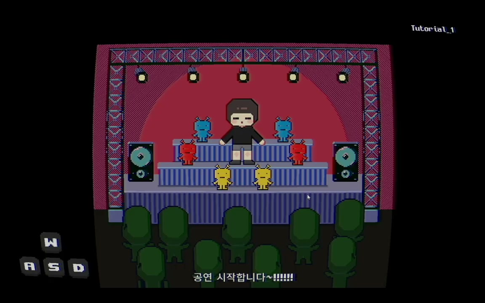
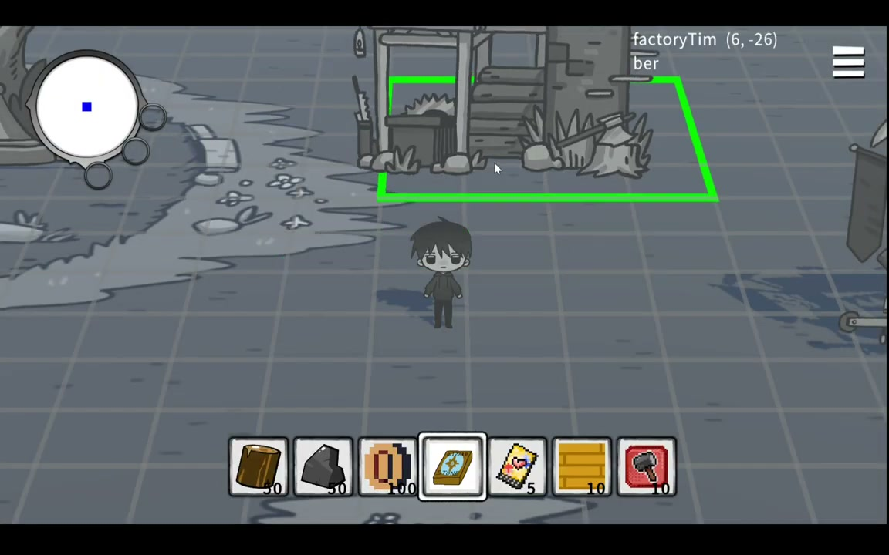

# Grayed Game

회색 마을을 탐험하며 플랫포머, 리듬 게임, 자원 수집과 건설을 경험하는 PC용 2D 어드벤처 게임입니다.

[플레이 영상](https://www.youtube.com/watch?v=fdvunwIGKAs) | [실행 파일](https://drive.google.com/file/d/1NscghxWgvjWWtu2stNFduW3cMFrBb4fl/view?usp=sharing)

[게임 설계](docs/game-design.md) | [상세 구현](docs/tooling.md) | [담당 범위](docs/contributions.md) | [검증 기록](docs/verification.md)

## 프로젝트 소개

| 항목 | 내용 |
| --- | --- |
| 플랫폼 | PC |
| 엔진 | Unity 2022.3.62f2 |
| 장르 | 2D 어드벤처, 미니게임, 메타픽션 |
| 개발 기간 | 2023.09 - 2026.01 |
| 팀 구성 | 기획, 프로그래밍, 아트, 사운드 |
| 담당 | 플랫포머, 탐험과 건설, 리듬 게임, 맵 제작 도구 |

기억에서 사라진 게임들이 모이는 마을이 배경입니다. 플레이어는 마을을 돌아다니며 주민과 대화하고, 각 장에서 서로 다른 게임의 규칙을 이용해 사건을 해결합니다.

기본 탐험 화면에서 다른 장르의 미니게임으로 들어갔다가 다시 마을로 돌아오는 구조입니다. 플랫포머, 리듬 게임, 자원 수집과 건설이 하나의 이야기 안에서 이어집니다.

| 리듬 미니게임 | 탐험과 건설 |
| --- | --- |
|  |  |

### 팀 결과

- 2024 BIC Rookie 부문 온오프라인 전시
- 2024 LOGIN 대학생 연합 발표회 기획 우수상
- 여러 장르의 플레이를 하나의 실행 파일로 통합

전시와 수상, 전체 게임 설계, 아트와 사운드는 팀이 함께 만든 결과입니다.

## 실행 방법

1. 저장소를 내려받아 Unity Hub에 프로젝트를 추가합니다.
2. Unity 2022.3.62f2로 열고 패키지 설치가 끝날 때까지 기다립니다.
3. `Assets/Scenes/Title.unity`를 열고 재생 버튼을 누릅니다.

설치 없이 플레이하려면 위의 실행 파일을 내려받으면 됩니다.

## 주요 기능

- 마을 탐험, 주민 대화와 사건 진행
- 장애물을 피하고 보상을 모아 상점과 다음 구간으로 이어지는 플랫포머 미니게임 `SuperArio`
- 자원 채집, 건물 배치, 생산, 제작과 가방 관리
- 제시된 자세를 박자에 맞춰 입력하는 리듬 미니게임 `Dancepace`
- 지역을 열어 빠르게 이동하고 미니맵과 안내 표시로 상호작용 대상을 확인
- 기획자가 Unity 편집 화면에서 맵을 직접 배치하고 곧바로 플레이를 확인하는 제작 도구

2024년 10월부터 2026년 1월까지 프로그래머로 참여해 플랫포머, 탐험과 건설, 리듬 게임, 맵 제작 도구를 맡았습니다. 세부 범위는 [담당 범위 문서](docs/contributions.md)에 정리했습니다.

## 사용 기술

| 기술 | 사용한 곳 |
| --- | --- |
| Unity, C# | 게임플레이, UI와 제작 도구 |
| Unity Input System | 이동, 상호작용과 리듬 입력 |
| ScriptableObject, CSV | 맵 요소, 스테이지와 리듬 패턴 데이터 관리 |
| URP 2D, Cinemachine, DOTween | 카메라, 화면 전환과 효과 |
| Yarn Spinner, Unity Localization | 대화와 한영 문구 관리 |
| Unity EditorWindow | 맵 배치와 게임 요소 설정 도구 |

## 구현 과정

### 플랫포머 미니게임

이동과 점프부터 시작해 피격, 코인, 장애물, 스테이지 전환, 상점과 보상까지 한 판의 흐름을 연결했습니다. 스테이지를 시작할 때 장애물을 미리 만들고 진행 중에는 필요한 장애물만 활성화해 재사용합니다.

[캐릭터 이동과 상태](Assets/Scripts/Runtime/CH2/SuperArio/Ario.cs) | [장애물 생성과 재사용](Assets/Scripts/Runtime/CH2/SuperArio/ObstacleManager.cs)

### 탐험과 건설

게임 속 위치를 칸 좌표로 바꾸고 이미 사용 중인 칸에는 건물이나 자원이 겹치지 않도록 관리했습니다. 자원 채집, 건물 배치, 생산, 제작과 가방 기능도 같은 좌표를 기준으로 동작하게 했습니다.

[좌표와 배치 상태 관리](Assets/Scripts/Runtime/CH3/Main/Core/GridSystem.cs) | [건물 생성](Assets/Scripts/Runtime/CH3/Main/Building/BuildingObjectFactory.cs)

### 리듬 미니게임

자세와 입력 시점을 데이터로 분리해 패턴을 코드 수정 없이 바꿀 수 있게 했습니다. 연습, 본게임, 결과 화면으로 진행 단계를 나누고 입력 결과에 따라 캐릭터와 관객의 반응, 점수와 효과가 함께 바뀌도록 했습니다.

[리듬 패턴 데이터](Assets/Scripts/Runtime/CH3/Dancepace/Data/WaveDataSO.cs) | [게임 진행](Assets/Scripts/Runtime/CH3/Dancepace/Managers/GameFlowManager.cs)

### 맵 제작 도구

기획자가 Unity 편집 화면에서 배치할 요소를 고르고 클릭이나 드래그로 맵을 만들 수 있는 도구를 구현했습니다. 시작 위치 지정, 빈 칸 한꺼번에 채우기, 삭제와 겹침 확인도 같은 화면에서 처리합니다.

[맵 제작 도구](Assets/Scripts/Editor/GridTileEditor.cs) | [오브젝트 설정 데이터](Assets/Scripts/Runtime/CH3/Main/Data/CH3_LevelData.cs)

## 문제 해결 기록

### 맵 수정이 프로그래머를 거쳐야 했던 문제

처음에는 기획자가 스프레드시트로 맵 수정을 전달하면 프로그래머가 Unity 장면에 다시 배치했습니다. 작은 수정도 전달, 재배치와 실행 파일 확인을 반복해야 했습니다.

기획자가 Unity 편집 화면에서 직접 배치한 뒤 재생 버튼을 눌러 확인하도록 제작 도구를 만들었습니다. 편집 도구와 실제 게임이 같은 설정 데이터를 읽게 해 크기, 이미지와 충돌 범위가 실행 중에도 그대로 적용되도록 했습니다.

마우스를 움직일 때마다 배치된 요소 전체를 검사하고 화면을 강제로 다시 그리는 작업도 반복되고 있었습니다. 배치된 칸을 저장해 요소 수가 달라졌을 때만 갱신하고 매 입력마다 실행하던 강제 화면 갱신을 제거했습니다.

### 점프 입력과 이동 계산의 시점 분리

점프 입력은 입력 콜백에서 받고 캐릭터 이동은 고정된 물리 갱신 단계에서 계산합니다. 점프 요청을 0.2초 동안 저장하고 물리 갱신 단계에서 실행하도록 두 흐름을 나눴습니다.

[점프 입력 처리](Assets/Scripts/Runtime/CH2/SuperArio/Ario.cs) | [제작 도구 상세 설명](docs/tooling.md)

## 팀

| 이름 | 역할 | 참여 기간 |
| --- | --- | --- |
| [한수빈](https://github.com/roweclaw) | 팀장, 기획 | 2024.03 - |
| [정우연](https://github.com/wooyn730) | PM, 프로그래머 | 2023.09 - |
| [송기화](https://github.com/Songkihwa) | 사운드 디자이너 | 2023.09 - |
| [이시원](https://github.com/NearthYou) | 프로그래머 | 2024.10 - |
| [서주미](https://github.com/seojumi) | 아티스트 | 2025.02 - |
| [이성연](https://github.com/4t4n) | 아티스트 | 2025.02 - |
| [이동호](https://github.com/CreatorLDH) | 기획 | 2023.09 - 2024.02, 2025.02 - |
| [지수민](https://github.com/Sumindd) | 기획 | 2024.03 - 2025.03, 2025.05 - |
