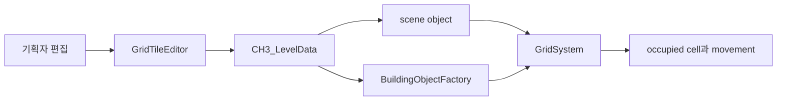

# Grayed Game

잊힌 게임이 떨어지는 회색 마을에서 챕터마다 다른 장르와 시스템을 만나는 PC 2D 메타픽션 어드벤처입니다.

[플레이 영상](https://www.youtube.com/watch?v=fdvunwIGKAs) | [공개 build](https://drive.google.com/file/d/1NscghxWgvjWWtu2stNFduW3cMFrBb4fl/view?usp=sharing)

[게임 설계](docs/game-design.md) | [제작 도구](docs/tooling.md) | [개인 기여](docs/contributions.md) | [검증](docs/verification.md)

## 프로젝트 개요

| 항목 | 내용 |
| --- | --- |
| 플랫폼 | PC |
| 엔진 | Unity 2022.3.62f2 |
| 장르 | 2D 어드벤처, 미니게임, 메타픽션 |
| 개발 기간 | 2023.09 - 2026.01 |
| 협업 | 기획, 개발, 아트, 사운드 팀 프로젝트 |
| 개인 역할 | 게임플레이 프로그래머, CH3 시스템, 에디터 도구, UI와 상호작용 |

Grayed Game은 잊힌 게임이 모이는 마을에서 라플리가 여러 게임의 규칙을 사용해 사건을 해결하는 이야기입니다. top-down 탐험을 중심에 두고 리듬, 플랫폼, TRPG, 자원 수집과 건설 규칙을 접속 콘텐츠로 연결합니다.

| Dancepace 리듬 미니게임 | CH3 건설과 자원 시스템 |
| --- | --- |
|  |  |

장르가 바뀌는 흐름과 각 시스템의 실제 동작은 플레이 영상에서 확인할 수 있습니다.

## 팀 결과

- 2024 BIC Rookie 부문 온오프라인 전시
- 2024 LOGIN 대학생 연합 발표회 기획 우수상
- 여러 장르의 플레이를 하나의 실행 가능한 빌드로 통합

전시와 수상, 전체 게임 설계, 아트와 사운드는 팀 결과입니다.

## 개인 기여

이시원은 2024년 10월부터 2026년 1월까지 프로그래머 2명 체제에서 CH3와 Dancepace를 중심으로 작업했습니다.

| 영역 | 구현 범위 |
| --- | --- |
| CH3 grid | world와 grid 좌표, occupied cell, spawn과 object state |
| Tile editor | type 선택, click과 drag 배치, spawn point, block fill과 겹침 방지 |
| Building | build mode, preview, factory, production, crafting과 inventory |
| Teleporter | 지역 활성화, list UI, fade 전환과 거리 기반 닫기 |
| Dancepace | wave data, input timing, character, UI, 관객과 sound 연출 |
| Interaction | Yarn dialogue, NPC, event area와 shop text 연결 |
| Maintenance | reflection 제거, editor build 제외, 사용하지 않는 field와 memory risk 정리 |

파일과 commit별 근거는 [개인 기여 문서](docs/contributions.md)에 구분했습니다.

## 대표 문제: 기획자가 직접 맵을 고치게 만들기

기획자가 spreadsheet로 전달한 맵을 프로그래머가 Unity scene에 다시 배치하던 흐름이었습니다. 작은 변경도 프로그래머와 빌드를 거쳐야 했고 기획자는 결과를 바로 확인하기 어려웠습니다.

`GridTileEditor`를 만들어 기획자가 Scene View에서 object를 배치하고 삭제하며 Play로 확인하게 했습니다. editor와 runtime은 같은 `CH3_LevelData`를 읽어 footprint, sprite, collision과 passability를 공유합니다.

첫 구현은 GridSystem search, reflection, 강제 Repaint와 object scan을 반복했습니다. 현재 source는 GridSystem reference와 property를 직접 사용하고 occupied position을 `HashSet`으로 구성합니다.

같은 장비와 같은 scene의 프로젝트 기록에서 Editor main thread frame time은 1084.8ms에서 52.7ms로 줄었습니다. 원본 profiler log와 반복 측정 분포가 없어 benchmark나 평균 개선율로 일반화하지 않습니다.

## CH3 editor와 runtime

editor 배치와 플레이 중 건설이 같은 data rule을 사용합니다. `GridSystem`은 occupied cell과 spawn을 관리하고 `BuildingObjectFactory`는 type에 맞는 runtime object를 만듭니다.

세부 흐름과 teleporter, Dancepace data는 [제작 도구 문서](docs/tooling.md)에 있습니다.

## 실행

1. Unity Hub에서 Unity 2022.3.62f2로 프로젝트를 엽니다.
2. package import가 끝날 때까지 기다립니다.
3. main scene을 열고 Play를 실행합니다.

저장소에는 Unity Test Framework test assembly가 없습니다. 이 문서 개편에서는 source, 프로젝트 version, Git history, link와 Markdown diff를 확인했습니다.

## 현재 한계

- 게임 전체 story와 모든 chapter의 완성을 주장하지 않습니다.
- editor frame time은 same-scene observation이며 원본 profiler distribution이 없습니다.
- source를 새로 빌드하거나 gameplay를 다시 측정하지 않았습니다.
- 공개 build와 수상은 현재 README의 프로젝트 기록을 유지합니다.
- 저장소의 코드와 asset에는 별도 open-source license가 명시되어 있지 않습니다.

## 팀

| 이름 | 역할 | 참여 기간 |
| --- | --- | --- |
| [한수빈](https://github.com/roweclaw) | 팀장, 기획 | 2024.03 - |
| [정우연](https://github.com/wooyn730) | PM, 프로그래머 | 2023.09 - |
| [송기화](https://github.com/Songkihwa) | 사운드 디자이너 | 2023.09 - |
| [이시원](https://github.com/NearthYou) | 프로그래머 | 2024.10 - |
| [서주미](https://github.com/seojumi) | 아티스트 | 2025.02 - |
| [이성연](https://github.com/4t4n) | 아티스트 | 2025.02 - |
| [이동호](https://github.com/CreatorLDH) | 기획 | 2023.09 - 2024.02, 2025.02 - |
| [지수민](https://github.com/Sumindd) | 기획 | 2024.03 - 2025.03, 2025.05 - |

이전 참여자의 이름과 기간은 Git history의 기존 README에서 계속 확인할 수 있습니다.
