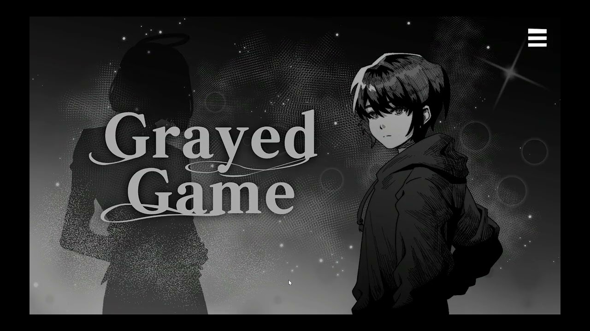

# Grayed Game

회색 마을을 탐험하며 플랫포머, 리듬 게임, 자원 수집과 건설을 경험하는 PC용 2D 어드벤처 게임입니다.

[플레이 영상](https://www.youtube.com/watch?v=fdvunwIGKAs) | [실행 파일](https://drive.google.com/file/d/1NscghxWgvjWWtu2stNFduW3cMFrBb4fl/view?usp=sharing)

[게임 설계](docs/game-design.md) | [상세 구현](docs/tooling.md) | [담당 범위](docs/contributions.md) | [코드와 자료](docs/verification.md)

## 프로젝트 소개

| 항목 | 내용 |
| --- | --- |
| 플랫폼 | PC |
| 엔진 | Unity 2022.3.62f2 |
| 장르 | 2D 어드벤처, 미니게임, 메타픽션 |
| 개발 기간 | 2023.09 - 2026.01 |
| 팀 구성 | 기획, 프로그래밍, 아트, 사운드 |
| 담당 | 플랫포머, 탐험과 건설, 리듬 게임, 맵 제작 도구 |

기억에서 사라진 게임들이 모이는 마을이 배경입니다. 플레이어는 마을을 돌아다니며 주민과 대화하고, 각 장에서 서로 다른 게임의 규칙을 이용해 사건을 해결합니다.

기본 탐험 화면에서 다른 장르의 미니게임으로 들어갔다가 다시 마을로 돌아오는 구조입니다. 플랫포머, 리듬 게임, 자원 수집과 건설이 하나의 이야기 안에서 이어집니다.

### 플레이 구조

| 리듬 미니게임 | 탐험과 건설 |
| --- | --- |
|  |  |

[플랫포머 플레이 구간](https://youtu.be/fdvunwIGKAs?t=84)

### 팀 결과

- 2024 BIC Rookie 부문 온오프라인 전시
- 2024 LOGIN 대학생 연합 발표회 기획 우수상
- 여러 장르의 플레이를 하나의 실행 파일로 통합

전시와 수상, 전체 게임 설계, 아트와 사운드는 팀이 함께 만든 결과입니다.

## 실행 방법

1. 저장소를 내려받아 Unity Hub에 프로젝트를 추가합니다.
2. Unity 2022.3.62f2로 열고 패키지 설치가 끝날 때까지 기다립니다.
3. `Assets/Scenes/Title.unity`를 열고 재생 버튼을 누릅니다.

설치 없이 플레이하려면 위의 실행 파일을 내려받으면 됩니다.

## 주요 기능

- 마을 탐험, 주민 대화와 사건 진행
- 장애물을 피하고 보상을 모아 상점과 다음 구간으로 이어지는 플랫포머 미니게임 `SuperArio`
- 자원 채집, 건물 배치, 생산, 제작과 가방 관리
- 제시된 자세를 박자에 맞춰 입력하는 리듬 미니게임 `Dancepace`
- 지역을 열어 빠르게 이동하고 미니맵과 안내 표시로 상호작용 대상을 확인
- 기획자가 Unity 편집 화면에서 맵을 직접 배치하고 곧바로 플레이를 확인하는 제작 도구

2024년 10월부터 2026년 1월까지 프로그래머로 참여해 플랫포머, 탐험과 건설, 리듬 게임, 맵 제작 도구를 맡았습니다. 세부 범위는 [담당 범위 문서](docs/contributions.md)에 정리했습니다.

## 사용 기술

| 기술 | 사용한 곳 |
| --- | --- |
| Unity, C# | 게임플레이, UI와 제작 도구 |
| Unity Input System | 이동, 상호작용과 리듬 입력 |
| ScriptableObject, CSV | 맵 요소, 스테이지와 리듬 패턴 데이터 관리 |
| URP 2D, Cinemachine, DOTween | 카메라, 화면 전환과 효과 |
| Yarn Spinner, Unity Localization | 대화와 한영 문구 관리 |
| Unity EditorWindow | 맵 배치와 게임 요소 설정 도구 |

## 구현 과정

### 플랫포머 미니게임

이동과 점프부터 시작해 피격, 코인, 장애물, 스테이지 전환, 상점과 보상이 한 판 안에서 이어지도록 구현했습니다. 스테이지를 시작할 때 장애물을 미리 만들고 진행 중에는 필요한 장애물만 활성화해 재사용합니다.

[캐릭터 이동과 상태](Assets/Scripts/Runtime/CH2/SuperArio/Ario.cs) | [장애물 생성과 재사용](Assets/Scripts/Runtime/CH2/SuperArio/ObstacleManager.cs)

### 탐험과 건설

게임 속 위치를 칸 좌표로 바꾸고 이미 사용 중인 칸에는 건물이나 자원이 겹치지 않도록 관리했습니다. 자원 채집, 건물 배치, 생산, 제작과 가방 기능도 같은 좌표를 기준으로 동작하게 했습니다.

[좌표와 배치 상태 관리](Assets/Scripts/Runtime/CH3/Main/Core/GridSystem.cs) | [건물 생성](Assets/Scripts/Runtime/CH3/Main/Building/BuildingObjectFactory.cs)

### 리듬 미니게임

자세와 입력 시점을 데이터로 분리해 패턴을 코드 수정 없이 바꿀 수 있게 했습니다. 연습, 본게임, 결과 화면으로 진행 단계를 나누고 입력 결과에 따라 캐릭터와 관객의 반응, 점수와 효과가 함께 바뀌도록 했습니다.

[리듬 패턴 데이터](Assets/Scripts/Runtime/CH3/Dancepace/Data/WaveDataSO.cs) | [게임 진행](Assets/Scripts/Runtime/CH3/Dancepace/Managers/GameFlowManager.cs)

### 맵 제작 도구

기획자가 Unity 편집 화면에서 배치할 요소를 고르고 클릭이나 드래그로 맵을 만들 수 있는 도구를 구현했습니다. 시작 위치 지정, 빈 칸 한꺼번에 채우기, 삭제와 겹침 확인도 같은 화면에서 처리합니다.

[맵 제작 도구](Assets/Scripts/Editor/GridTileEditor.cs) | [오브젝트 설정 데이터](Assets/Scripts/Runtime/CH3/Main/Data/CH3_LevelData.cs)

## 문제 해결 기록

### 맵 수정이 코드 병합을 기다리던 문제

#### 문제 상황

처음에는 기획자가 스프레드시트로 좌표를 전달하면 프로그래머가 Unity 장면에 다시 배치했습니다. 맵을 조금만 바꿔도 전달, 재배치, 실행 파일 확인을 반복해야 했고 맵 제작 도구가 병합되기 전까지 다음 레벨 디자인 작업도 멈춰 있었습니다.

#### 선택한 방법

좌표 변환만 자동화해서는 전달 과정이 그대로 남습니다. 기획자가 Unity 편집 화면에서 직접 배치하고 같은 장면을 바로 재생해 확인할 수 있도록 했습니다.

클릭과 드래그 배치, 삭제, 시작 위치 지정, 빈 칸 채우기와 겹침 확인을 한 창에 넣었습니다. 편집 화면과 실제 게임이 같은 설정 데이터를 읽게 해 크기, 이미지, 충돌 범위와 차지하는 칸도 한곳에서 관리했습니다.

#### 편집 화면

장면에 배치한 요소가 늘자 마우스를 움직일 때마다 전체를 다시 찾고 화면을 강제로 그리는 작업이 반복됐습니다. 배치된 칸을 저장하고 요소 수가 달라졌을 때만 갱신하도록 바꿔 편집 중 반복되던 탐색과 화면 갱신을 줄였습니다.

#### 결과

기획자는 별도의 실행 파일을 기다리지 않고 배치와 플레이 확인을 반복할 수 있게 됐습니다. 편집 화면과 실제 게임의 배치 기준도 같은 데이터에서 가져오므로 한쪽만 수정해 결과가 달라지는 문제를 줄였습니다.

[맵 제작 도구 코드](Assets/Scripts/Editor/GridTileEditor.cs) | [맵 설정 데이터](Assets/Scripts/Runtime/CH3/Main/Data/CH3_LevelData.cs) | [좌표와 배치 상태 관리](Assets/Scripts/Runtime/CH3/Main/Core/GridSystem.cs)

### 플랫포머 화면을 오갈 때 상태가 남던 문제

#### 문제 상황

플랫포머 안에는 스테이지뿐 아니라 상점과 보상 공간도 있습니다. 각 화면이 카메라, 입력, UI와 소리를 따로 바꾸면서 상점에 들어간 뒤 무적 상태가 남거나, 상점에서 나왔을 때 체력이 다시 초기화되는 문제가 생겼습니다.

#### 선택한 방법

화면마다 필요한 값을 제각각 바꾸지 않고 현재 진행 상태를 한곳에서 관리했습니다. 스테이지, 상점, 보상 공간으로 전환할 때 입력 가능 여부, 카메라 우선순위, 화면 비율, UI와 BGM을 함께 갱신했습니다.

상점에 들어갈 때는 무적 상태를 끝내고, 상점에서 돌아올 때는 남은 체력을 유지합니다. 보상 공간을 나갈 때는 완료한 스테이지를 저장한 뒤 마을로 복귀하도록 전환마다 초기화할 값과 이어갈 값을 나눴습니다.

#### 결과

스테이지, 상점, 보상 공간을 오가더라도 이전 화면의 상태가 다음 화면에 남지 않게 됐습니다. 화면 전환과 함께 처리해야 할 항목도 한 흐름에서 확인할 수 있습니다.

[플랫포머 진행 상태](Assets/Scripts/Runtime/CH2/SuperArio/ArioManager.cs) | [상점 진입 처리](Assets/Scripts/Runtime/CH2/SuperArio/EnterPipe.cs) | [플랫포머 플레이 구간](https://youtu.be/fdvunwIGKAs?t=84)

### 비트 길이에 따라 리듬 판정이 달라지던 문제

#### 문제 상황

초기 판정은 정답 시점에서 몇 초 차이인지를 보는 방식이었습니다. 같은 시간 차이라도 짧은 비트에서는 크게 늦은 입력이 되고 긴 비트에서는 작은 차이가 되기 때문에, 패턴의 박자 길이가 바뀌면 판정 감각도 함께 달라졌습니다.

#### 선택한 방법

입력 시간을 비트 길이로 나눠 한 비트를 0부터 1까지의 비율로 바꿨습니다. 가운데를 정답 시점으로 두고 가까운 입력은 Perfect, 그다음 범위는 Great, 나머지는 Bad로 판정합니다.

정답 자세와 비트 길이, 쉬는 시간은 패턴 데이터로 분리했습니다. 정답이 아닌 키를 누르거나 비트 시작 전에 키를 누르고 있거나, 끝까지 입력하지 않은 경우도 같은 판정 흐름에서 처리합니다.

#### 결과

길이가 다른 비트도 같은 비율을 기준으로 판정할 수 있게 됐습니다. 패턴과 판정 범위도 데이터에서 바꿀 수 있어 새로운 웨이브를 추가할 때 판정 코드를 다시 수정할 필요가 없습니다.

[리듬 게임 진행과 판정](Assets/Scripts/Runtime/CH3/Dancepace/Managers/GameFlowManager.cs) | [패턴 데이터](Assets/Scripts/Runtime/CH3/Dancepace/Data/WaveDataSO.cs) | [판정 설정](Assets/Scripts/Runtime/CH3/Dancepace/Data/GameConfigSO.cs)

[리듬 게임 플레이 구간](https://youtu.be/fdvunwIGKAs?t=119)

## 팀

| 이름 | 역할 | 참여 기간 |
| --- | --- | --- |
| [한수빈](https://github.com/roweclaw) | 팀장, 기획 | 2024.03 - |
| [정우연](https://github.com/wooyn730) | PM, 프로그래머 | 2023.09 - |
| [송기화](https://github.com/Songkihwa) | 사운드 디자이너 | 2023.09 - |
| [이시원](https://github.com/NearthYou) | 프로그래머 | 2024.10 - |
| [서주미](https://github.com/seojumi) | 아티스트 | 2025.02 - |
| [이성연](https://github.com/4t4n) | 아티스트 | 2025.02 - |
| [이동호](https://github.com/CreatorLDH) | 기획 | 2023.09 - 2024.02, 2025.02 - |
| [지수민](https://github.com/Sumindd) | 기획 | 2024.03 - 2025.03, 2025.05 - |
