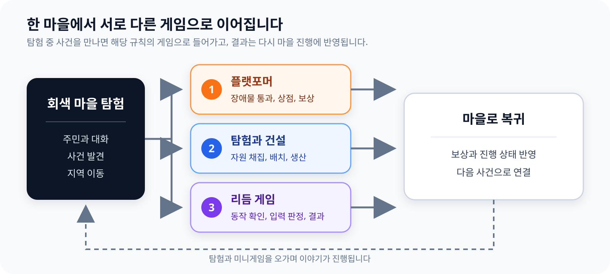

# 게임 설계

## 배경

기억에서 사라진 게임들이 회색 마을로 떨어집니다. 시간이 지나면 게임의 색과 형태도 흐려집니다. 플레이어가 조작하는 라플리는 아직 누군가에게 기억되고 있어 마을에서 사라지지 않은 인물입니다.

라플리는 주민과 대화하고 마을에서 일어난 사건을 따라갑니다. 사건마다 다른 게임의 규칙으로 들어가 문제를 해결한 뒤 다시 마을로 돌아옵니다.

## 플레이 흐름

마을 탐험이 중심이고 플랫포머, 자원 수집과 건설, 리듬 게임이 사건에 따라 열립니다. 각 미니게임은 조작과 화면이 다르지만 완료 결과는 다시 마을의 진행 상태로 이어집니다.

## 플랫포머

자동으로 이동하는 캐릭터가 점프와 앉기로 장애물을 피합니다. 스테이지에서 코인을 모아 상점에서 아이템을 사고, 정해진 구간을 통과하면 보상 공간을 거쳐 마을로 돌아옵니다.

오프닝, 스테이지, 상점과 보상 공간은 한 장면 안에서 카메라와 화면 비율을 바꾸며 이어집니다. 상세한 상태 전환은 [제작 도구와 게임 로직](tooling.md#스테이지-상점과-보상-공간)에 정리했습니다.

## 탐험과 건설

플레이어는 마을을 돌아다니며 자원을 모으고 건물을 배치합니다. 건물은 여러 칸을 차지할 수 있으며 이미 사용 중인 칸에는 다른 건물이나 자원이 겹치지 않습니다.

자원 채집, 건물 생산, 제작과 가방이 한 흐름으로 이어집니다. 지역을 열면 이동 목록에서 목적지를 골라 빠르게 이동할 수 있습니다.

## 리듬 게임

무대 위 인물이 보여 주는 자세를 기억한 뒤 WASD로 같은 자세를 입력합니다. 연습에서는 한 동작씩 익히고, 본게임에서는 제한 시간 동안 이어지는 패턴을 맞춥니다.

입력 시점은 비트 길이에 대한 비율로 계산해 Perfect, Great, Bad로 나눕니다. 결과에 따라 캐릭터와 관객의 반응, 효과와 점수가 함께 바뀝니다.

## 대화와 진행

주민 대화는 사건의 시작과 미니게임 진입, 완료 뒤 마을 복귀를 연결합니다. 한영 문구와 대화 분기는 게임 진행 상태에 따라 달라집니다.

[플레이 영상](https://www.youtube.com/watch?v=fdvunwIGKAs) | [담당 범위](contributions.md) | [코드와 자료](verification.md)
