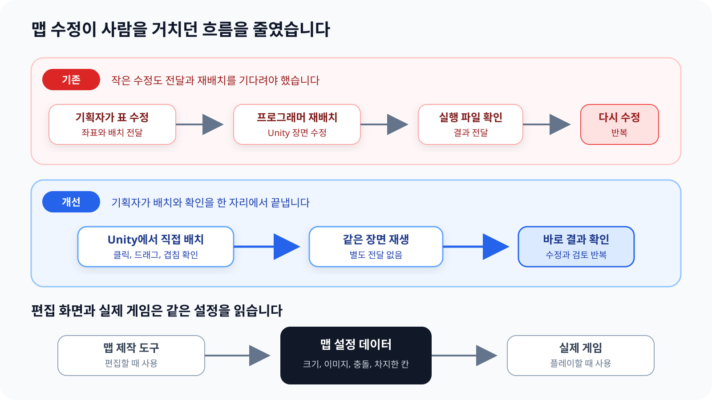
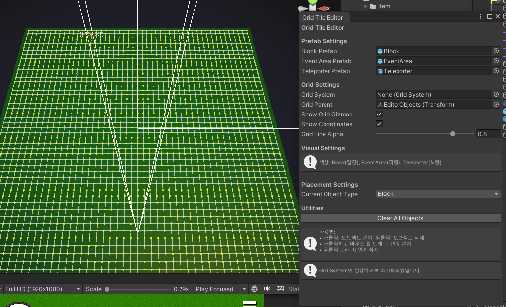
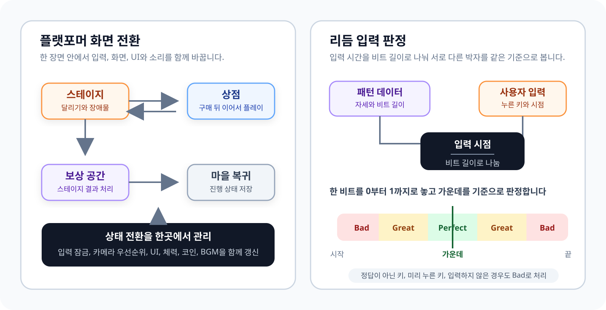

# 제작 도구와 게임 로직

README에서는 플레이와 문제 해결 흐름을 먼저 보여 줍니다. 이 문서에는 맵 제작 도구, 탐험과 건설, 플랫포머, 리듬 게임의 코드 구조를 조금 더 자세히 정리했습니다.

## 맵 제작 도구

기획자가 스프레드시트로 좌표를 전달하고 프로그래머가 Unity 장면에 다시 배치하던 과정을 Unity 편집 화면 안으로 옮겼습니다.

편집 창에서 배치할 요소를 고른 뒤 장면을 클릭하거나 드래그해 맵을 만듭니다. 삭제, 시작 위치 지정, 빈 칸 채우기와 겹침 확인도 같은 창에서 처리합니다.

### 편집 결과가 실제 게임과 달라지지 않게

편집 화면과 실제 게임이 같은 맵 설정 데이터를 읽습니다. 각 요소의 크기, 이미지, 충돌 범위, 통과 가능 여부와 차지하는 칸을 한곳에서 관리합니다.

편집할 때는 제작 도구가 이 설정으로 장면에 요소를 놓고, 플레이 중에는 생성 코드가 같은 설정으로 건물과 오브젝트를 만듭니다. 생성 시점은 달라도 배치 규칙은 같습니다.

[맵 제작 도구](../Assets/Scripts/Editor/GridTileEditor.cs) | [맵 설정 데이터](../Assets/Scripts/Runtime/CH3/Main/Data/CH3_LevelData.cs) | [플레이 중 건물 생성](../Assets/Scripts/Runtime/CH3/Main/Building/BuildingObjectFactory.cs)

### 편집 중 반복 작업 줄이기

처음에는 마우스가 움직일 때마다 장면에서 좌표 시스템을 다시 찾고, 배치된 요소 전체를 검사한 뒤 화면을 강제로 다시 그렸습니다. 맵이 커질수록 같은 작업이 입력마다 반복됐습니다.

좌표 시스템은 한 번 찾은 참조를 사용하고, 배치된 칸은 빠르게 확인할 수 있는 집합으로 저장했습니다. 장면의 요소 수가 바뀐 경우에만 목록을 갱신하고 매 입력마다 실행하던 화면 갱신도 제거했습니다.

## 탐험과 건설

게임 속 위치를 칸 좌표로 바꾸고, 이미 사용 중인 칸에는 다른 건물이나 자원이 겹치지 않도록 관리합니다. 건물 크기가 여러 칸이어도 차지하는 모든 칸을 함께 등록하고 해제합니다.

건설 미리 보기, 실제 배치, 자원 생성과 맵 제작 도구가 같은 좌표 기준을 사용합니다. 자원 채집, 건물 생산, 제작과 가방 기능도 이 배치 상태를 기준으로 이어집니다.

[좌표와 배치 상태](../Assets/Scripts/Runtime/CH3/Main/Core/GridSystem.cs) | [건물 생성](../Assets/Scripts/Runtime/CH3/Main/Building/BuildingObjectFactory.cs)

## 플랫포머

### 스테이지, 상점과 보상 공간

플랫포머는 오프닝, 스테이지, 상점, 보상 공간과 마을 복귀로 이어집니다. 이 흐름을 관리하는 코드가 현재 상태를 바꾸면서 입력, 카메라, 화면 비율, UI와 BGM을 함께 갱신합니다.

상점에 들어갈 때는 무적 상태를 끝내고 플레이 입력을 막습니다. 상점에서 돌아올 때는 남은 체력을 유지한 채 스테이지를 다시 시작하고, 보상 공간을 나갈 때는 완료한 스테이지를 저장합니다.

[플랫포머 진행 상태](../Assets/Scripts/Runtime/CH2/SuperArio/ArioManager.cs) | [상점 진입](../Assets/Scripts/Runtime/CH2/SuperArio/EnterPipe.cs)

### 장애물 재사용

스테이지가 시작되면 필요한 장애물을 미리 만들고, 화면 밖으로 나간 장애물은 끈 뒤 다음 순서에서 다시 사용합니다. 진행 중에 같은 장애물을 계속 만들고 없애지 않습니다.

[장애물 생성과 재사용](../Assets/Scripts/Runtime/CH2/SuperArio/ObstacleManager.cs)

### 점프 입력과 이동 계산

점프 입력은 입력 콜백에서 받고 실제 이동은 고정된 물리 갱신 단계에서 처리합니다. 입력 콜백은 점프 요청을 0.2초 동안 저장하고, 물리 갱신 단계가 바닥 상태를 확인한 뒤 요청을 실행합니다.

[캐릭터 이동과 점프](../Assets/Scripts/Runtime/CH2/SuperArio/Ario.cs)

## 리듬 게임

초기 판정은 정답 시점에서 몇 초 차이인지를 봤습니다. 비트 길이가 달라지면 같은 시간 차이의 의미도 달라져, 입력 시간을 비트 길이로 나눈 비율을 기준으로 바꿨습니다.

한 비트를 0부터 1까지로 놓고 가운데를 기준으로 Perfect, Great, Bad 범위를 나눕니다. 정답이 아닌 키, 미리 누르고 있던 키와 입력하지 않은 경우도 같은 흐름에서 Bad로 처리합니다.

### 패턴과 판정 설정

패턴 데이터에는 정답 자세, 비트 길이와 쉬는 시간이 들어갑니다. 판정 범위와 보상은 별도 설정에 두어 새로운 패턴을 추가할 때 판정 코드를 다시 고치지 않게 했습니다.

연습에서는 예시 동작을 먼저 보여 주고, 본게임에서는 제한 시간 동안 여러 패턴을 진행합니다. 입력 결과는 캐릭터와 관객의 반응, 점수, 효과와 결과 화면으로 이어집니다.

[게임 진행과 판정](../Assets/Scripts/Runtime/CH3/Dancepace/Managers/GameFlowManager.cs) | [패턴 데이터](../Assets/Scripts/Runtime/CH3/Dancepace/Data/WaveDataSO.cs) | [판정 설정](../Assets/Scripts/Runtime/CH3/Dancepace/Data/GameConfigSO.cs)

## 지역 이동

활성화된 지역만 이동 목록에 표시하고 현재 위치는 목록에서 뺍니다. 이동 중에는 다른 상호작용을 막고 화면을 가린 뒤 위치를 옮겨 장면 전환이 보이지 않게 처리합니다.

[지역 이동 설정](../Assets/Scripts/Runtime/CH3/Main/World/README_TeleportSystem.md)
