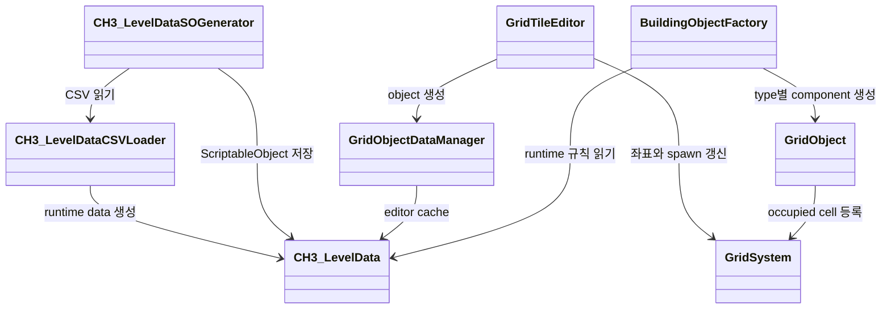
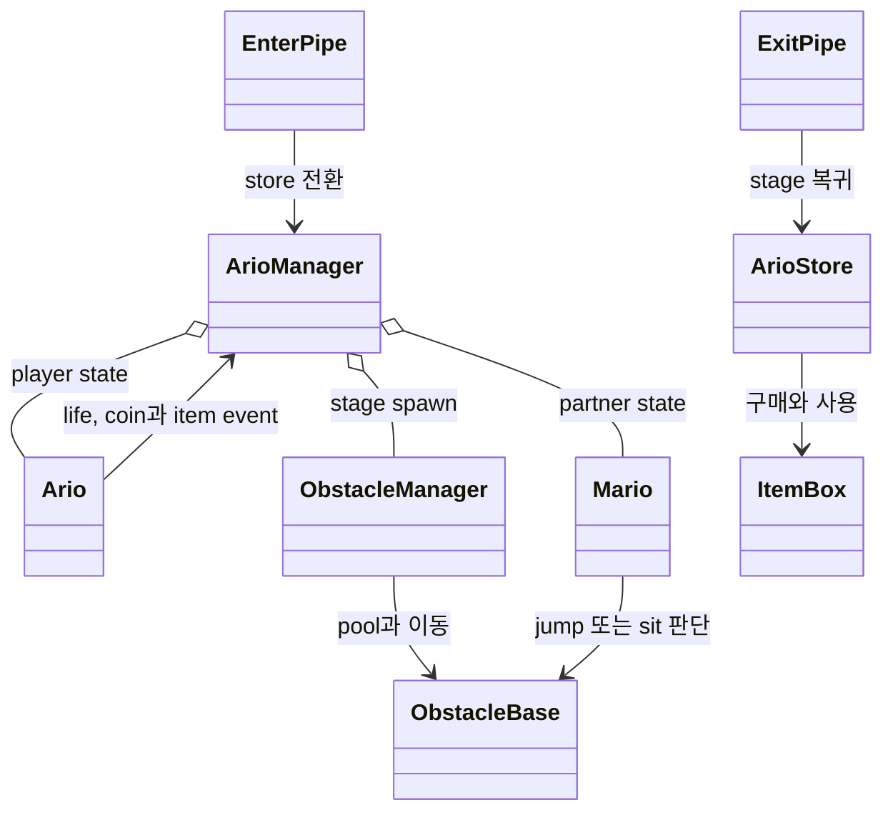

# 제작 도구와 미니게임 구조

## 기획자 편집 흐름

초기에는 spreadsheet로 받은 map을 programmer가 Unity scene에 다시 배치했습니다. 작은 수정도 build를 거쳐야 했고 기획자는 결과를 바로 확인하기 어려웠습니다.

`GridTileEditor`는 Scene View에서 object type을 고르고 click과 drag로 배치하거나 삭제하는 EditorWindow입니다. spawn point 지정, block fill과 occupied cell 확인도 같은 window에서 처리합니다.

## Editor 성능 정리

첫 구현은 Scene View update 때마다 GridSystem을 다시 찾고 강제 Repaint와 배치 object scan을 반복했습니다.

현재 source는 GridSystem reference와 grid property를 직접 사용하고, 강제 Repaint를 제거했습니다. occupied position은 `HashSet<Vector2Int>`로 구성해 겹침을 검사합니다.

같은 장비와 같은 scene의 Unity Profiler record에서 Editor main thread frame time이 1084.8ms에서 52.7ms로 줄었습니다. raw log와 반복 측정 분포가 없어 평균 성능이나 일반적인 개선율로 확장하지 않습니다.

## 데이터 계약

| 책임 | 구현 |
| --- | --- |
| object type과 footprint | `CH3_LevelData` |
| CSV와 ScriptableObject 연결 | `CH3_LevelDataCSVLoader`, Editor generator |
| grid coordinate와 occupied cell | `GridSystem` |
| editor 배치 | `GridTileEditor` |
| runtime object 생성 | `BuildingObjectFactory` |
| 건물과 생산 | `Structure`, `Producer`와 관련 data |

editor와 runtime이 같은 `CH3_LevelData`를 읽으므로 sprite, collision, footprint와 passability 기준을 한곳에서 바꿀 수 있습니다.

Editor에서는 `GridObjectDataManager`, runtime에서는 `BuildingObjectFactory`가 같은 `CH3_LevelData`를 읽습니다. 둘은 object 생성 시점이 다르지만 footprint와 sprite, collision 기준을 공유합니다.

## runtime grid

`GridSystem`은 world position과 grid position을 변환하고 occupied cell, spawn area와 object count를 관리합니다. building, ore, NPC와 teleporter는 grid object 계약을 통해 같은 field에 배치됩니다.

`BuildingObjectFactory`는 data type을 보고 runtime class를 선택합니다. editor object와 플레이어가 새로 만든 건물이 같은 footprint와 grid state를 사용합니다.

## CH2 SuperArio 플랫포머

`ArioManager`는 stage, play, pause, store, reward와 game-over state를 조율합니다. `Ario`와 `Mario`는 이동과 충돌 반응을 맡고, `ObstacleManager`는 pool을 재사용해 stage data에 맞는 obstacle을 흘려보냅니다.

상점은 `EnterPipe`에서 별도 camera와 `ArioStore` state로 전환됩니다. `ItemBox`는 coin 조건과 사용 결과를 나누며 `ExitPipe`가 main stage 복귀를 요청합니다. 실제 구현은 `Assets/Scripts/Runtime/CH2/SuperArio`에서 확인할 수 있습니다.

## teleporter

`TeleporterManager`는 BaseCamp, Michael, Farmer, Dollar region과 activation state를 관리합니다. BaseCamp는 처음부터 active이고 현재 위치를 뺀 active region만 정해진 순서로 보여줍니다.

player가 tower와 interaction하면 `TeleportUI`가 region button을 표시합니다. 2m interaction range를 벗어나면 0.1초 간격 distance check가 UI를 닫습니다.

이동 중에는 interaction을 막고 fade out, position change, fade in 뒤 0.1초 delay를 거쳐 state를 reset합니다. 현재 source에는 별도의 3초 cooldown과 UI close distance field가 없습니다.

scene setup은 code 옆의 [teleporter guide](../Assets/Scripts/Runtime/CH3/Main/World/README_TeleportSystem.md)를 따릅니다.

## Dancepace data와 flow

`WaveDataSO`와 `GameConfigSO`가 wave, timing과 게임 규칙을 보관합니다. `GameFlowManager`, `DPTimeline`, UI와 character class가 rehearsal, play와 result state를 나눠 처리합니다.

string comparison을 줄이고 enum과 string table을 사용해 input, text와 result를 연결합니다. source와 resource 경계는 프로젝트 history의 Dancepace commit에서 확인할 수 있습니다.
